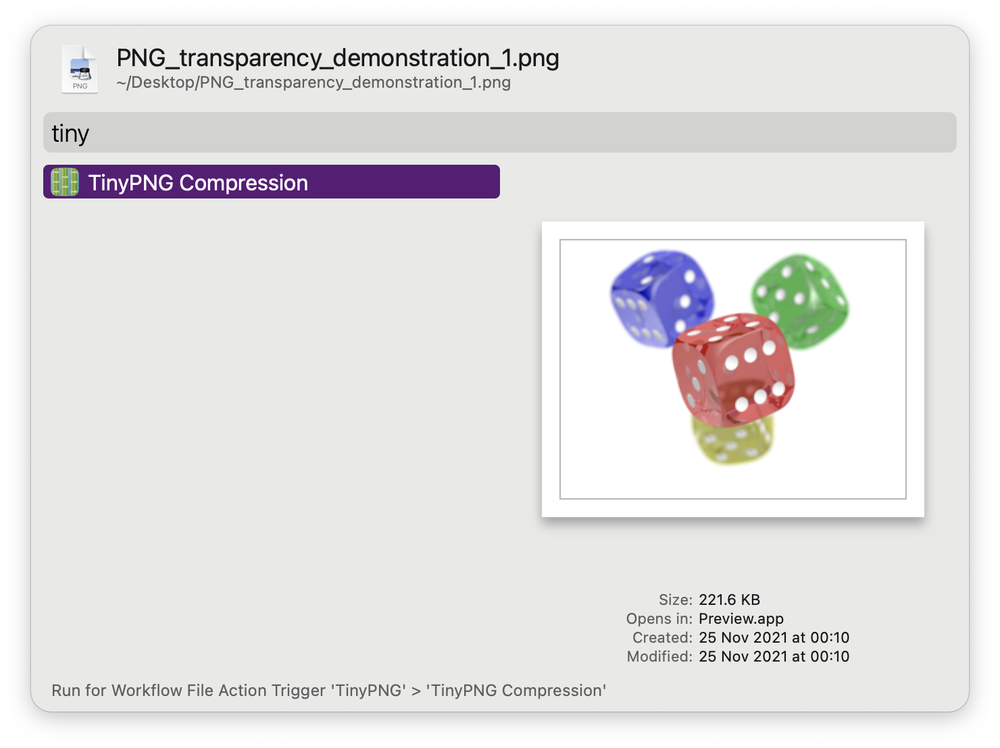

#  TinyPNG Alfred Workflow

Compress images via TinyPNG

<a href='https://github.com/alfredapp/tinypng-workflow/releases/latest/download/TinyPNG.alfredworkflow'>⤓ Download Workflow</a>

> On Alfred 4 use <a href='https://github.com/alfredapp/tinypng-workflow/releases/download/2022.3/TinyPNG.alfredworkflow'>alternative link</a>

## Setup

[Get an API key](https://tinypng.com/developers) for TinyPNG.

## Usage

Use the [Universal Action](https://www.alfredapp.com/help/features/universal-actions/) to compress PNG, JPEG, and WebP images via [TinyPNG](https://tinypng.com/).

Alteratively, run the Search Keywords (default: `tinypng`) and type to filter.

